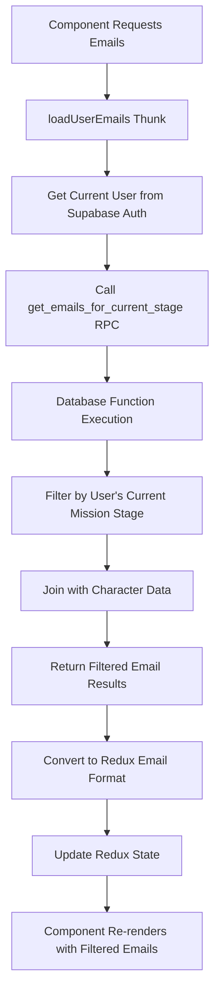
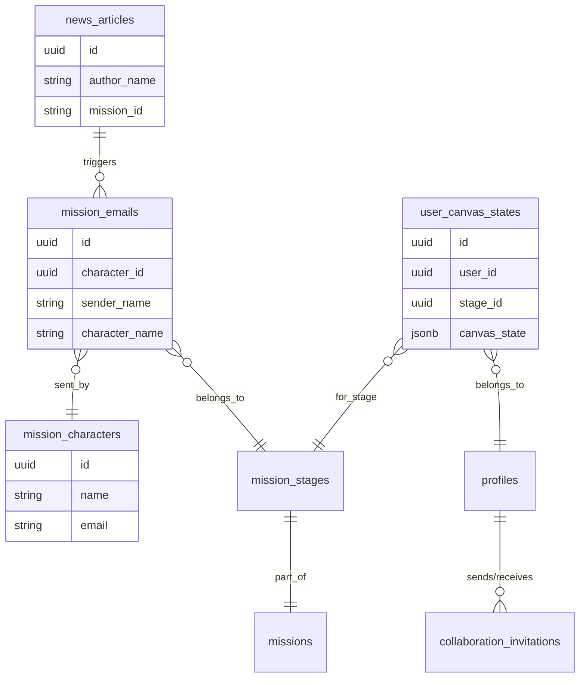

# Redux Implementation Summary - System Tycoon

## Overview
This document provides a comprehensive summary of the Redux implementation in System Tycoon, highlighting key patterns, best practices, and the centralized requirements validation system using Redux. This document consolidates all state management patterns across the application.

## Store Architecture

### Slice Organization
```
src/store/slices/
├── emailSlice.ts           - Email management with stage-based filtering
├── canvasSlice.ts          - System design canvas persistence  
├── mentorSlice.ts          - Mentor chat and guidance state
└── collaborationSlice.ts   - Collaboration invitations and real-time state

src/features/design/
└── designSlice.ts          - Core design state with requirements validation
```

### Root Store Configuration
- **RTK**: Using Redux Toolkit for simplified store setup
- **Middleware**: Default RTK middleware with proper serialization
- **DevTools**: Redux DevTools enabled for development debugging

## Canvas State Isolation Implementation

### Problem Solved
When switching between mission stages, the canvas retained components from previous stages instead of loading the correct isolated state for each stage.

### Solution Architecture

#### 1. Database Integration
- **Table**: `user_canvas_states` - Stores canvas state per user per stage
- **Schema**:
  ```sql
  CREATE TABLE user_canvas_states (
    id UUID,
    user_id UUID,
    mission_id UUID,
    stage_id UUID,
    canvas_state JSONB,  -- Stores nodes, edges, viewport
    last_saved TIMESTAMP WITH TIME ZONE,
    stage_title TEXT,
    mission_title TEXT
  );
  ```

#### 2. Canvas API Updates
```typescript
// Updated to use user_canvas_states table instead of user_mission_progress
loadCanvasState: builder.query({
  queryFn: async ({ userId, stageId }) => {
    const { data, error } = await supabase
      .from('user_canvas_states')
      .select('canvas_state, last_saved')
      .eq('user_id', userId)
      .eq('stage_id', stageId)
      .single();
    // ...
  }
})
```

#### 3. Design Slice Enhancement
```typescript
// New action for clearing canvas state
clearCanvas: (state, action: PayloadAction<{ keepRequirements?: boolean }>) => {
  // Clear nodes and edges
  state.nodes = [];
  state.edges = [];
  state.selectedNodeId = null;
  
  // Clear drag state and validation
  state.draggedComponent = null;
  state.isDragging = false;
  state.totalCost = 0;
  state.isValidDesign = false;
  state.validationErrors = [];
  
  // Reset viewport
  state.canvasViewport = { x: 0, y: 0, zoom: 1 };
  
  // Optionally preserve requirements when switching stages
  if (!keepRequirements) {
    state.systemRequirements = [];
    state.requirementValidationResults = [];
    // ...
  }
}
```

#### 4. Cross-Mission Contamination Detection
```typescript
// Enhanced canvas initialization with contamination detection
const initializeCanvasForStage = useCallback(() => {
  // 1. Clear canvas when loading new stage
  dispatch(clearCanvas({ keepRequirements: false }));
  
  // 2. Validate saved state for cross-mission contamination
  if (savedCanvasData?.canvasState?.nodes) {
    const contaminatedNodes = savedCanvasData.canvasState.nodes.filter(node => 
      node.data?.label?.includes('Margaret') || 
      node.data?.name?.includes('Margaret')
    );
    
    if (contaminatedNodes.length > 0) {
      console.error('❌ CROSS-MISSION CONTAMINATION DETECTED');
      await clearCorruptedCanvasState(missionStageData.id);
      loadInitialSystemState(missionStageData.id);
      return;
    }
  }
  
  // 3. Load validated state or fresh initial state
}, [dispatch, missionStageData, savedCanvasData]);
```

## User-Interaction-Based Validation System (COMPLETELY USER-DRIVEN)

### Problem Solved
Previous implementation had excessive auto-validation that ran constantly during canvas loading and initialization, causing performance issues and spammy console logs. The system was validating requirements even when users hadn't interacted with the canvas.

### Solution: Pure User-Interaction Validation

#### 1. Interaction Tracking State
```typescript
// Track user interactions to only validate when user has actually modified the canvas
const [hasUserInteracted, setHasUserInteracted] = useState(false);
const [lastUserActionTimestamp, setLastUserActionTimestamp] = useState<number>(0);
```

#### 2. User Action Detection
```typescript
// React Flow event handlers now track user interactions
const onConnect = useCallback((params: Connection) => {
  // ... connection logic
  
  // Track user interaction
  setHasUserInteracted(true);
  setLastUserActionTimestamp(Date.now());
  console.log('👤 User connected components - marking for validation');
  
  dispatch(addEdgeAction(params));
}, [dispatch, nodes]);

// Drag & Drop tracking
const onDrop = useCallback((event: React.DragEvent) => {
  // ... drop logic
  
  // Track user interaction
  setHasUserInteracted(true);
  setLastUserActionTimestamp(Date.now());
  console.log('👤 User added component via drag & drop - marking for validation');
  
  dispatch(addNode({ component, position }));
}, [screenToFlowPosition, dispatch, availableComponents]);

// Node/Edge change tracking
onNodesChange={(changes) => {
  // Track user interactions for node changes (move, select, delete, etc.)
  const userActionChanges = changes.filter(change => 
    change.type === 'position' || change.type === 'remove' || change.type === 'select'
  );
  
  if (userActionChanges.length > 0) {
    setHasUserInteracted(true);
    setLastUserActionTimestamp(Date.now());
    console.log('👤 User modified nodes - marking for validation');
  }
  
  dispatch(onNodesChange(changes));
}}
```

#### 3. Pure User-Interaction Validation
```typescript
// User-interaction-based validation - ONLY validate after user actions
useEffect(() => {
  if (!hasUserInteracted || !missionStageData?.id) return;
  
  // Debounce validation to avoid excessive calls during rapid user actions
  const timer = setTimeout(() => {
    console.log('🎯 Validating requirements after user interaction...');
    validateRequirements(nodes, edges);
    
    // Reset interaction flag after validation
    setHasUserInteracted(false);
  }, 800); // Slightly longer delay to ensure all actions are complete
  
  return () => clearTimeout(timer);
}, [hasUserInteracted, lastUserActionTimestamp, missionStageData?.id, validateRequirements, nodes, edges]);

// NO AUTOMATIC VALIDATION - Requirements are validated only when:
// 1. User interacts with canvas (above useEffect)
// 2. User clicks "Test System" button (handleRunTest)
// 3. Timer test is triggered from GameHUD (timerTestTriggered useEffect)
```

#### 4. Manual Validation Triggers Only
```typescript
// Handle starting the design process - manual validation via "Test System" button
const handleRunTest = useCallback(async () => {
  if (!missionStageData?.id) {
    console.warn('No stage ID available for validation');
    return;
  }
  
  console.log('🧪 Manual validation triggered via "Test System" button');
  await validateRequirements(nodes, edges);
  
  // Reset interaction flag since we just validated
  setHasUserInteracted(false);
}, [validateRequirements, nodes, edges, missionStageData?.id]);
```

### Validation Now Runs Only When:
- ✅ User adds/removes components via drag & drop
- ✅ User connects/disconnects components  
- ✅ User moves/selects/deletes components
- ✅ User clicks "Test System" button
- ✅ Timer test is triggered from GameHUD

### No More Validation During:
- ❌ Canvas initialization
- ❌ Mission stage loading
- ❌ Saved state loading
- ❌ Component mounting
- ❌ Redux state updates from system operations
- ❌ Any automatic/background processes

### Before vs After Performance:

**Before** (Spammy - 3+ validations during load):
```
📋 Running initial requirements validation for stage...
📋 Running initial requirements validation for stage...
📋 Running initial requirements validation for stage...
🎨 Initializing canvas for stage: 550e8400-e29b-41d4-a716-446655440001
📂 Loading saved canvas state into design slice
[Multiple validation calls during loading]
```

**After** (Clean - Zero validations during load):
```
🎨 Initializing canvas for stage: 550e8400-e29b-41d4-a716-446655440001
📂 Loading saved canvas state into design slice
[No validation until user interacts]
[User adds component]
👤 User added component via drag & drop - marking for validation
🎯 Validating requirements after user interaction...
```

## Design Slice Implementation (Requirements Validation)

### State Shape
```typescript
interface DesignState {
  // React Flow Canvas State
  nodes: Node[];
  edges: Edge[];
  selectedNodeId: string | null;
  
  // Drag and Drop State
  draggedComponent: ComponentData | null;
  isDragging: boolean;
  
  // Design Metrics
  totalCost: number;
  isValidDesign: boolean;
  validationErrors: ValidationError[];
  
  // Canvas Viewport
  canvasViewport: { x: number; y: number; zoom: number };

  // Requirements Validation State
  systemRequirements: SystemRequirement[];
  requirementValidationResults: RequirementValidationResult[];
  allRequirementsMet: boolean;
  requirementProgress: {
    completed: number;
    total: number;
    percentage: number;
  };
}
```

### Requirements Validation Flow

#### 1. Mission Stage Loading
```typescript
// In CrisisSystemDesignCanvas.tsx
if (stageData.system_requirements && stageData.system_requirements.length > 0) {
  dispatch(setSystemRequirements(stageData.system_requirements));
  console.log('✅ System requirements dispatched to Redux');
}
```

#### 2. Automatic Validation on Canvas Changes
```typescript
// In designSlice.ts - all canvas modification actions trigger validation
addNode: (state, action) => {
  // ... node addition logic
  designSlice.caseReducers.validateRequirements(state);
  designSlice.caseReducers.validateDesign(state);
},

addEdge: (state, action) => {
  // ... edge addition logic  
  designSlice.caseReducers.validateRequirements(state);
  designSlice.caseReducers.validateDesign(state);
}
```

#### 3. Real-time Validation Engine
```typescript
validateRequirements: (state) => {
  const validationResults: RequirementValidationResult[] = [];
  
  state.systemRequirements.forEach(requirement => {
    let completed = false;
    
    switch (requirement.validation_type) {
      case 'node_count':
        // Validate minimum nodes of specific types
        if (requirement.min_nodes_of_type) {
          const results = Object.entries(requirement.min_nodes_of_type).map(([category, minCount]) => {
            const nodeCount = state.nodes.filter(node => 
              node.data.category === category || 
              (category === 'compute' && ['web_server', 'app_server', 'server'].includes(node.type || ''))
            ).length;
            return { category, required: minCount, actual: nodeCount, met: nodeCount >= minCount };
          });
          completed = results.every(r => r.met);
        }
        break;
        
      case 'edge_connection':
        // Validate required connections between component types
        if (requirement.required_connection) {
          const { from, to } = requirement.required_connection;
          completed = state.edges.some(edge => {
            const sourceNode = state.nodes.find(n => n.id === edge.source);
            const targetNode = state.nodes.find(n => n.id === edge.target);
            return matchesComponentType(sourceNode, from) && matchesComponentType(targetNode, to);
          });
        }
        break;
        
      case 'node_removal':
        // Validate forbidden nodes are removed
        if (requirement.required_nodes) {
          const forbiddenNodesPresent = requirement.required_nodes.filter(forbiddenId => 
            state.nodes.some(node => node.id === forbiddenId)
          );
          completed = forbiddenNodesPresent.length === 0;
        }
        break;
    }
    
    validationResults.push({
      id: requirement.id,
      description: requirement.description,
      completed,
      validationDetails: { /* detailed validation info */ }
    });
  });
  
  // Update progress metrics
  state.requirementValidationResults = validationResults;
  state.allRequirementsMet = validationResults.every(r => r.completed);
  state.requirementProgress = {
    completed: validationResults.filter(r => r.completed).length,
    total: validationResults.length,
    percentage: /* calculated percentage */
  };
}
```

### Redux Best Practices Implementation

#### ✅ Centralized State Management
```typescript
// Requirements state is centralized in Redux, not component props
// Components connect directly to Redux store via selectors

// BAD (old approach): Prop drilling
<Requirements 
  requirements={requirements}
  systemRequirements={missionStageData.system_requirements}
  canvasNodes={nodes}
  canvasEdges={edges}
/>

// GOOD (new approach): Direct Redux connection
<Requirements onTestSystem={handleRunTest} />
```

#### ✅ Memoized Selectors for Performance
```typescript
// Memoized selectors prevent unnecessary re-renders
export const selectRequirementsStatus = createSelector(
  [selectRequirementValidationResults, selectRequirementProgress],
  (validationResults, progress) => ({
    requirements: validationResults,
    progress,
    allMet: validationResults.length > 0 && validationResults.every(req => req.completed),
    completedCount: progress.completed,
    totalCount: progress.total,
    percentage: progress.percentage
  })
);

export const selectCanvasValidation = createSelector(
  [selectNodes, selectEdges, selectIsValidDesign, selectValidationErrors, selectAllRequirementsMet],
  (nodes, edges, isValidDesign, validationErrors, allRequirementsMet) => ({
    isValidDesign,
    validationErrors,
    allRequirementsMet,
    canProceed: isValidDesign && allRequirementsMet,
    hasComponents: nodes.length > 0,
    hasConnections: edges.length > 0
  })
);
```

#### ✅ Component Store Connection
```typescript
// Requirements component connects directly to Redux
export const Requirements: React.FC<RequirementsProps> = ({ onTestSystem, className }) => {
  // Connect to Redux store using memoized selectors (Redux best practice)
  const requirementsStatus = useAppSelector(selectRequirementsStatus);
  const canvasValidation = useAppSelector(selectCanvasValidation);

  const { requirements, progress, allMet } = requirementsStatus;
  const { canProceed } = canvasValidation;

  // Component renders based on Redux state, no props needed
  return (
    <div className={clsx(styles.requirements, className)}>
      {/* UI renders from Redux state */}
    </div>
  );
};
```

## Collaboration Slice Implementation

### Invitation System Architecture

The collaboration system enables users to invite others to work together on mission stages in real-time. This implementation follows Redux best practices for managing invitations, email notifications, and collaborative state.

#### State Shape
```typescript
interface CollaborationState {
  // Invitation Management
  sentInvitations: CollaborationInvitation[];
  receivedInvitations: CollaborationInvitation[];
  
  // Loading States
  isLoading: boolean;
  isSendingInvitation: boolean;
  isUpdatingInvitation: boolean;
  
  // Error Handling
  error: string | null;
  sendError: string | null;
  
  // UI State
  unreadInvitationsCount: number;
}
```

#### Database Integration
```sql
-- Collaboration invitations table with proper RLS policies
CREATE TABLE collaboration_invitations (
  id UUID DEFAULT gen_random_uuid() PRIMARY KEY,
  sender_id UUID NOT NULL REFERENCES profiles(id) ON DELETE CASCADE,
  invited_id UUID NOT NULL REFERENCES profiles(id) ON DELETE CASCADE,
  mission_stage_id UUID NOT NULL REFERENCES mission_stages(id) ON DELETE CASCADE,
  status TEXT NOT NULL DEFAULT 'pending' CHECK (status IN ('pending', 'accepted', 'declined', 'expired')),
  created_at TIMESTAMP WITH TIME ZONE DEFAULT timezone('utc'::text, now()) NOT NULL,
  expires_at TIMESTAMP WITH TIME ZONE DEFAULT (timezone('utc'::text, now()) + INTERVAL '7 days') NOT NULL,
  UNIQUE(sender_id, invited_id, mission_stage_id)
);
```

#### Async Thunk Implementation
```typescript
// Send collaboration invitation with email generation
export const sendCollaborationInvitation = createAsyncThunk(
  'collaboration/sendInvitation',
  async (params: {
    inviteeEmail: string;
    missionStageId: string;
    missionId: string;
  }, { getState, rejectWithValue }) => {
    try {
      // 1. Validate sender authentication
      // 2. Find recipient by email/username
      // 3. Check for existing invitations
      // 4. Create collaboration invitation record
      // 5. Generate emails for both sender and recipient
      // 6. Return complete invitation data with populated references
    } catch (error) {
      return rejectWithValue(error.message);
    }
  }
);
```

## Email Slice Implementation

### Stage-Based Filtering Implementation

#### Database Layer
- **Function**: `get_emails_for_current_stage(p_user_id UUID)`
- **Purpose**: Server-side filtering of emails based on user's current mission progress
- **Logic**: 
  - Queries user's current mission stage from `user_mission_progress`
  - Returns only emails associated with the current stage
  - Handles cases where user hasn't started missions (shows stage 1 emails)

#### Redux Integration
```typescript
// Async thunk for loading stage-filtered emails
export const loadUserEmails = createAsyncThunk(
  'email/loadUserEmails',
  async (_, { rejectWithValue }) => {
    try {
      const emails = await fetchEmails(); // Calls database function
      return emails.map(convertToReduxFormat);
    } catch (error) {
      return rejectWithValue(error.message);
    }
  }
);
```

### Email State Flow



## State Management Data Flow Analysis

### Complete User Action Flow
This section traces the complete data flow from a user action through to UI updates:

#### Step 1: User Clicks "Contact" in News Article
**Component:** `BentoGrid.tsx`
**Redux Slice:** None (local state)
**Supabase Tables:** None

```typescript
// BentoGrid.tsx - Direct callback pattern
const handleContactClick = (e: React.MouseEvent) => {
  e.stopPropagation();
  if (article && onContact) {
    onContact(article);  // Passes NewsArticle object
  }
};
```

**Issues Identified:**
- No Redux state management for article selection
- Direct callback pattern instead of Redux action

#### Step 2: EmailComposer Modal Opens
**Component:** `EmailComposer.tsx`
**Redux Slice:** Uses `auth` slice for user
**Supabase Tables:** `news_articles` (update), `profiles` (read)

```typescript
// Shows news article author name, not mission character
const convertArticleToHero = (article: NewsArticle): NewsHero => {
  return {
    name: article.author_name,  // Shows "Community Health Tracker"
    organization: article.publication_name,
  };
};
```

#### Step 3: User Sends Email
**Component:** `EmailComposer.tsx`
**Redux Slice:** None (should use mission slice)
**Supabase Tables:** `mission_emails` (insert), `news_articles` (update), `user_mission_progress` (upsert)

**Data Flow:**
```typescript
const emailRecord = {
  sender_name: senderName,
  sender_email: senderEmail,
  recipient_email: emailData.to,
  recipient_name: emailData.hero?.name,  // Still news author name
  subject: emailData.subject,
  body: emailData.body,
  mission_id: emailData.missionId,
  stage_id: emailData.stageId,
  character_id: null,  // NOT SET - This causes the name mismatch!
};
```

#### Step 4: User Opens System Design Canvas
**Component:** `CrisisSystemDesignCanvas.tsx`
**Redux Slices:** `design`, `canvas`, `mission`
**Supabase Tables:** `mission_emails`, `mission_stages`, `mission_stage_requirements`

**Canvas Initialization Flow:**
```typescript
const fetchMissionStageFromEmail = async (emailId: string) => {
  // 1. Get stage_id from email
  const { data: emailData } = await supabase
    .from('mission_emails')
    .select('id, mission_id, stage_id')
    .eq('id', emailId)
    .single();

  // 2. Load mission stage data
  const stageData = await missionService.loadMissionStageById(emailData.stage_id);
};
```

**Redux State Updates:**
```typescript
// Properly uses Redux patterns
dispatch(clearCanvas({ keepRequirements: false }));
dispatch(addNode({ component, position, nodeData }));
dispatch(addEdgeAction({ source, target }));
dispatch(setSystemRequirements(stageData.system_requirements));
```

### Redux Pattern Violations and Fixes

#### Slices Following Best Practices
1. **canvas slice** ✅
   - Proper action creators
   - Serializable state
   - Good selector patterns
   - Follows RTK patterns

2. **design slice** ✅
   - Clear separation of concerns
   - Proper validation logic
   - User-interaction-based validation
   - Good use of reducers

#### Slices Needing Improvement
1. **email slice** ⚠️
   - Should handle more email operations via Redux actions
   - Some global window functions should be Redux actions

2. **mission slice** ⚠️
   - Missing async thunks for mission operations
   - Some side effects in components instead of middleware

### Missing Middleware

According to best practices, should have:
- `gameMiddleware` - Not implemented
- `simulationMiddleware` - Not used in this flow
- `multiplayerMiddleware` - Should handle collaboration

## Database Schema and State Relationships

### Key Table Relationships


### Data Integrity Issues

1. **Name Mismatch Issue**: The EmailComposer shows the news article author's name, but the email inbox shows character names from the mission_emails table
2. **Canvas State Contamination**: User canvas states can get mixed between different missions
3. **Character Assignment**: User's contact email doesn't set character_id properly

## Benefits of Current Redux Architecture

### 1. **Single Source of Truth**
- All requirements validation logic in one place (designSlice)
- Canvas state isolated per mission stage
- Centralized collaboration state management
- Email filtering at database level

### 2. **Automatic State Updates**
- Canvas changes automatically trigger requirement validation (when user interacts)
- Real-time feedback without excessive polling
- Components automatically re-render when validation state changes
- Cross-mission contamination automatically detected and cleaned

### 3. **Performance Optimization**
- User-interaction-based validation prevents spam
- Memoized selectors prevent unnecessary re-renders
- Debounced validation for smooth user experience
- Database-level filtering reduces payload size

### 4. **Developer Experience**
- Redux DevTools show complete state flow
- Clear separation between UI logic and business logic
- Type-safe selectors with TypeScript integration
- Enhanced debugging with detailed console logs

### 5. **Scalability**
- Easy to add new requirement types and validation rules
- Canvas state isolation allows unlimited mission stages
- Modular slice architecture supports feature expansion
- Collaboration system ready for real-time features

## Future Enhancements

### Planned Improvements
1. **Advanced Validation Rules**: Support for performance metrics, security requirements
2. **Real-Time Collaboration**: Complete WebSocket integration for live editing
3. **Enhanced Error Handling**: Better error boundaries and user feedback
4. **Email Redux Migration**: Move remaining email operations to Redux actions
5. **Mission Progress Integration**: Deeper integration with advancement system
6. **Analytics Integration**: Track user interaction patterns and requirement completion

### Real-Time Collaboration Features (Planned)

The current collaboration implementation handles **invitation flow only**. The following real-time collaborative features are documented but not yet implemented:

#### Missing Components
1. **Real-Time Canvas Synchronization**:
   - `design_sessions` table for active collaboration sessions
   - `canvas_components` and `canvas_connections` for real-time sync
   - `session_participants` for active collaborator tracking

2. **Live Cursor Tracking**:
   - `useRealtimeCollaboration` hook with Supabase Realtime
   - `CollaboratorCursor` and `CursorManager` components
   - Presence API integration for cursor positions

3. **Component Synchronization**:
   - Real-time component add/move/delete across clients
   - Conflict resolution for simultaneous edits
   - Optimistic updates with rollback capability

#### Implementation Priority
- **Phase 1** ✅ Invitation system (COMPLETE)
- **Phase 2** 🔄 Real-time cursor tracking and presence
- **Phase 3** 🔄 Component synchronization and conflict resolution
- **Phase 4** 🔄 Performance optimization and polish

## Conclusion

The Redux implementation in System Tycoon now follows industry best practices with:

- **Centralized state management** - All validation and collaboration logic in Redux slices
- **User-interaction-based validation** - Efficient validation only when users actually interact
- **Canvas state isolation** - Clean separation between mission stages with contamination detection
- **Automatic cleanup** - Cross-mission contamination automatically detected and resolved
- **Performance optimization** - Memoized selectors and debounced validation
- **Type safety** - Full TypeScript support with proper error handling
- **Enhanced debugging** - Comprehensive logging and state visibility

This architecture provides a solid foundation for complex system design validation and collaboration features while maintaining excellent performance and developer experience. The collaboration invitation system serves as a foundation for future real-time collaborative features, and the user-interaction-based validation system ensures optimal performance without sacrificing functionality. 