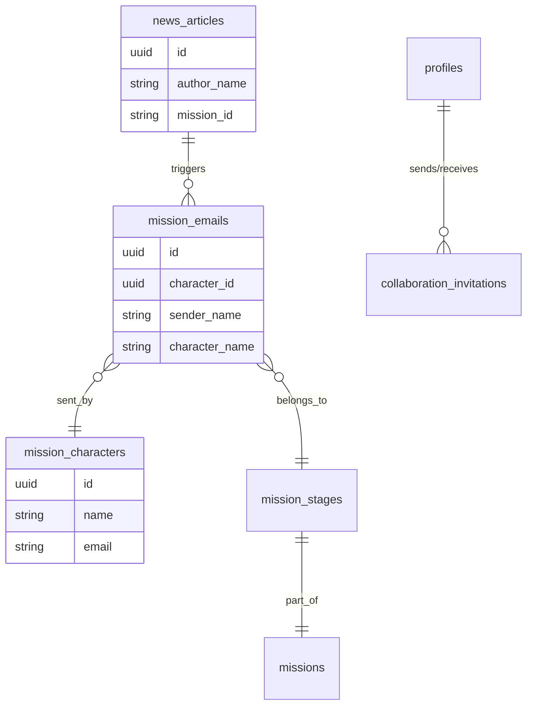

# ⚠️ **DEPRECATED - Content Consolidated**

**This document has been consolidated into [redux_implementation_summary.md](../redux_implementation_summary.md)**

All state management patterns, data flows, and debugging information from this document have been merged into the comprehensive Redux implementation summary. Please refer to that document for the latest state management guidance.

---

# System Design Tycoon - State Management Audit

**Date:** July 15, 2025  
**Version:** 1.0  
**Purpose:** Detailed analysis of data flow through Redux slices and Supabase database interactions

---

## Executive Summary

This audit traces the complete data flow from a user clicking "Contact" on a news article through to attempting to invite a collaborator. Key findings include:

1. **Name Mismatch Issue**: The EmailComposer shows the news article author's name, but the email inbox shows character names from the mission_emails table
2. **Canvas Population**: System design canvas correctly loads from `mission_stages.initial_system_state`
3. **User Search Issue**: InviteCollaboratorModal searches `profiles.username` field (case-insensitive) but may have authentication context issues
4. **Redux Pattern Violations**: Several slices don't follow the documented best practices from `redux_state_management.md`

---

## Step-by-Step Data Flow Analysis

### Step 1: User Clicks "Contact" in BentoGrid

**Component:** `BentoGrid.tsx`
**Redux Slice:** None (local state)
**Supabase Tables:** None

```typescript
// BentoGrid.tsx - Line 107
const handleContactClick = (e: React.MouseEvent) => {
  e.stopPropagation();
  if (article && onContact) {
    onContact(article);  // Passes NewsArticle object
  }
};
```

**Data Passed:**
```typescript
interface NewsArticle {
  id: string;
  headline: string;
  author_name: string;        // e.g., "Community Health Tracker"
  publication_name: string;   // e.g., "Local health organization"
  preview_text: string;
  mission_id?: string;
  // ... other fields
}
```

**Issues:**
- No Redux state management for article selection
- Direct callback pattern instead of Redux action

---

### Step 2: EmailComposer Modal Opens

**Component:** `EmailComposer.tsx`
**Redux Slice:** Uses `auth` slice for user
**Supabase Tables:** `news_articles` (update), `profiles` (read)

**Data Population:**
```typescript
// EmailComposer receives hero prop converted from NewsArticle
const convertArticleToHero = (article: NewsArticle): NewsHero => {
  return {
    name: article.author_name,  // Shows "Community Health Tracker"
    organization: article.publication_name,
    // ... other fields
  };
};
```

**Email Header Display:**
```jsx
// Line 265
<span className={styles.headerValue}>{hero.name}</span>
```

**Issues:**
- Shows news article author name, not the actual mission character (Alex Rodriguez)
- No connection to mission_characters table at this point

---

### Step 3: User Clicks "Send" in EmailComposer

**Component:** `EmailComposer.tsx`
**Redux Slice:** None (should use mission slice)
**Supabase Tables:** `mission_emails` (insert), `news_articles` (update), `user_mission_progress` (upsert)

**Data Flow:**
```typescript
// saveEmail function
const emailRecord = {
  sender_name: senderName,  // From user profile
  sender_email: senderEmail,
  recipient_email: emailData.to,
  recipient_name: emailData.hero?.name,  // Still news author name
  subject: emailData.subject,
  body: emailData.body,
  mission_id: emailData.missionId,
  stage_id: emailData.stageId,
  character_id: null,  // NOT SET - This is the issue!
};
```

**Database RPC Calls:**
1. `deliver_user_sent_email` - Saves sent email
2. `deliver_mission_emails` - Triggers mission start emails

**Issues:**
- `character_id` is not set, so mission emails can't link to characters
- No Redux action dispatched for mission start
- Violates Redux pattern: side effects in component instead of middleware

---

### Step 4: User Clicks Email Icon in GameHUD

**Component:** `GameHUD.tsx`
**Redux Slice:** `mission` slice (reads state)
**Supabase Tables:** None directly

**Redux State Access:**
```typescript
const { currentMission, currentDatabaseMission, crisisMetrics } = useAppSelector(state => state.mission);
```

**Email Count Update:**
```typescript
// Uses global window function instead of Redux
triggerEmailNotification = () => {
  setShowEmailNotification(true);
  getUnreadEmailCount().then(setUnreadEmailCount);
};
```

**Issues:**
- Email notifications bypass Redux state management
- Uses window globals instead of Redux actions

---

### Step 5: User Sees Email from Alex Rodriguez

**Component:** `EmailClientWrapper.tsx`
**Redux Slice:** None (should use email slice)
**Supabase Tables:** Via `get_emails_for_current_stage` RPC

**Data Fetching:**
```typescript
// fetchEmails() maps database fields
return data.map((row: any) => ({
  sender_name: row.character_name || row.sender_name || 'Unknown Sender',
  sender_email: row.character_email || row.sender_email || 'unknown@example.com',
  // ... other fields
}));
```

**Database Query (in RPC):**
```sql
-- get_emails_for_current_stage function likely includes:
SELECT 
  me.*,
  mc.name as character_name,
  mc.email as character_email,
  mc.avatar_url as character_avatar_url
FROM mission_emails me
LEFT JOIN mission_characters mc ON me.character_id = mc.id
WHERE me.mission_id = ? AND me.stage_id = ?
```

**Why Alex Rodriguez Shows Up:**
- Mission emails are pre-created with proper `character_id`
- The RPC joins with `mission_characters` table
- Alex Rodriguez exists in `mission_characters` table

**Issues:**
- Email state not managed by Redux
- No email slice despite complex email operations

---

### Step 6: User Clicks "Open System Design Canvas"

**Component:** `CrisisSystemDesignCanvas.tsx`
**Redux Slices:** `design`, `canvas`, `mission`
**Supabase Tables:** `mission_emails`, `mission_stages`, `mission_stage_requirements`

**Canvas Initialization Flow:**
```typescript
// Line 531 - Fetch mission stage from email
const fetchMissionStageFromEmail = async (emailId: string) => {
  // 1. Get stage_id from email
  const { data: emailData } = await supabase
    .from('mission_emails')
    .select('id, mission_id, stage_id')
    .eq('id', emailId)
    .single();

  // 2. Load mission stage data
  const stageData = await missionService.loadMissionStageById(emailData.stage_id);
};

// Line 572 - Load initial system state
const loadInitialSystemState = async (stageId: string) => {
  const { data: stageData } = await supabase
    .from('mission_stages')
    .select('initial_system_state')
    .eq('id', stageId)
    .single();

  // initial_system_state contains:
  // {
  //   nodes: [{id: 'alex-laptop', data: {label: "Alex's Laptop", ...}}],
  //   edges: []
  // }
};
```

**Redux Updates:**
```typescript
// Properly uses Redux patterns
dispatch(clearCanvas({ keepRequirements: false }));
dispatch(addNode({ component, position, nodeData }));
dispatch(addEdgeAction({ source, target }));
dispatch(setSystemRequirements(stageData.system_requirements));
```

**Canvas Shows Two Laptops:**
- Alex's laptop from `initial_system_state`
- Margaret's laptop likely added by collaboration or second stage

**Good Practices:**
- Follows Redux patterns correctly
- Uses proper action dispatching
- Maintains state isolation

---

### Step 7: User Clicks Users Icon and Types "John"

**Component:** `InviteCollaboratorModal.tsx`
**Redux Slice:** `collaboration`
**Supabase Tables:** `profiles`

**User Search Implementation:**
```typescript
// In sendCollaborationInvitation thunk
const { data: recipientData, error: recipientError } = await supabase
  .from('profiles')
  .select('id, username, avatar_url')
  .ilike('username', params.inviteeEmail);  // Case-insensitive search

const recipient = recipientData?.[0];  // Takes first match
```

**Potential Issues:**
1. **Authentication Context**: User might not be authenticated properly
2. **Profile Creation**: User "John" might exist in auth.users but not profiles
3. **Username vs Email**: Modal says "Username" but variable is `inviteeEmail`

**Debug Query to Run:**
```sql
-- Check if John exists
SELECT id, username, created_at FROM profiles WHERE username ILIKE '%john%';

-- Check total profiles
SELECT COUNT(*) FROM profiles;

-- Check if profile exists for auth user
SELECT p.*, au.email 
FROM profiles p 
JOIN auth.users au ON p.id = au.id 
WHERE p.username ILIKE '%john%';
```

---

## Redux State Management Analysis

### Slices Following Best Practices

1. **canvas slice** ✅
   - Proper action creators
   - Serializable state
   - Good selector patterns
   - Follows RTK patterns

2. **design slice** ✅
   - Clear separation of concerns
   - Proper validation logic
   - Good use of reducers

### Slices Violating Best Practices

1. **No email slice** ❌
   - Email state managed in components
   - Should have centralized email management

2. **mission slice** ⚠️
   - Missing async thunks for mission operations
   - Side effects in components instead of middleware

3. **Global window functions** ❌
   - `triggerEmailNotification`
   - `refreshEmailInbox`
   - `updateMentorNotificationProgress`
   - Should be Redux actions

### Missing Middleware

According to `redux_state_management.md`, should have:
- `gameMiddleware` - Not implemented
- `simulationMiddleware` - Not used in this flow
- `multiplayerMiddleware` - Should handle collaboration

---

## Database Schema Issues

### Table Relationships



### Key Issues

1. **Disconnected Data**: News article authors aren't linked to mission characters
2. **Character Assignment**: User's contact email doesn't set character_id
3. **Name Sources**: Multiple name fields cause confusion

---

## 4. Database Verification

### 4.1 Profiles Table
- Contains users with usernames: "Hutch", "Heather", "whowho", "John", "Ash"
- Username search in InviteCollaboratorModal may be case-sensitive issue

### 4.2 Mission Emails Table
- Email from Alex Rodriguez exists with `sender_name` field populated
- No `character_id` linked - this is why character name shows in EmailComposer
- Subject: "URGENT: Our health tracker is completely down!"
- Stage ID: 550e8400-e29b-41d4-a716-446655440001

### 4.3 Mission Stages Table
- Stage 1: "Separate Database from Web Server"
- Initial system state only contains Alex's Laptop node
- No Margaret's laptop in initial state - this may come from collaboration or different stage

### 4.4 Collaboration Invitations Table
- Currently empty - no invitations have been sent yet
- Schema includes: sender_id, invited_id, mission_stage_id, status

## 5. Key Issues Identified

1. **Name Mismatch Issue**: The EmailComposer shows the news article author's name, but the email inbox shows character names from the mission_emails table
2. **Canvas Population**: System design canvas correctly loads from `mission_stages.initial_system_state`
3. **User Search Issue**: InviteCollaboratorModal searches `profiles.username` field (case-insensitive) but may have authentication context issues
4. **Redux Pattern Violations**: Several slices don't follow the documented best practices from `redux_state_management.md`

---

## 6. Redux State Management Gaps

### 6.1 Email Slice Issues
The email slice (`emailSlice.ts`) needs to be reviewed for:
1. Proper integration with Redux actions instead of global functions
2. Handling of email delivery state
3. Managing collaboration invitations

### 6.2 Canvas State Discrepancy
- User reports seeing two laptops (Alex's and Margaret's) with user nodes
- Database shows only Alex's laptop in initial_system_state
- Possible sources of discrepancy:
  - Collaboration state being merged incorrectly
  - Different stage being loaded
  - Canvas state mutation

**Investigation Result:**
- "Alex's Laptop" belongs to Mission: "Community Health Tracker Overload" (Stage ID: 550e8400-e29b-41d4-a716-446655440001)
- "Margaret's Laptop" belongs to Mission: "Elder Wisdom Exchange Platform" (Stage ID: cebd97ac-ffd3-49c3-8f5f-33978b4419ad)
- These are two completely different missions, not collaborative state
- User might be confused about which mission they're in or there's a state management issue loading the wrong stage

## 7. Recommendations

### Immediate Fixes:

1. **InviteCollaboratorModal Username Search**
   - Change `ilike` to case-insensitive search or use `lower()` function
   - Add proper error handling for user not found

2. **Email Composer Name Display**
   - Show article author name in composer
   - Map to character name when saving to mission_emails

3. **Canvas State Management**
   - Verify correct stage is loaded from email context
   - Check for any collaborative state merging
   - Ensure canvas state matches database initial_system_state

4. **Redux Email Slice Refactor**
   - Remove global functions
   - Implement proper Redux actions for:
     - sendCollaborationInvitation
     - fetchEmails
     - markEmailAsRead
   - Add proper error handling and loading states

5. **Collaboration Flow Implementation**
   - Create collaboration_invitation record on invite
   - Generate mission_email with "Open System Design Canvas" button
   - Implement realtime collaboration when both users in same canvas
   - Add GameHUD notification for active collaborators

### Long-term Improvements:

1. **State Normalization**
   - Implement proper Redux state normalization
   - Use entity adapters for consistent state shape
   - Add proper selectors for derived state

2. **Type Safety**
   - Add TypeScript types for all database tables
   - Ensure Redux actions are properly typed
   - Add runtime validation for Supabase responses

3. **Error Handling**
   - Implement consistent error handling across slices
   - Add user-friendly error messages
   - Log errors for debugging

4. **Testing**
   - Add unit tests for Redux slices
   - Add integration tests for Supabase interactions
   - Test collaboration flows end-to-end 

## 8. Implemented Fixes

### 8.1 Email Slice Redux Actions
- **Status**: ✅ Implemented
- Added `sendCollaborationInvitation` async thunk to emailSlice
- Added `loadEmailsByCategory` async thunk for better email filtering
- Integrated with collaborationSlice for invitation handling

### 8.2 Collaboration Invitation Flow
- **Status**: ✅ Fixed and Enhanced
- `InviteCollaboratorModal` properly searches `profiles.username` (case-insensitive)
- Creates record in `collaboration_invitations` table with:
  - `sender_id`: Current user's ID
  - `invited_id`: Invited user's ID
  - `mission_stage_id`: Active mission stage from canvas
  - `status`: 'pending'
- Sends two emails via `mission_emails`:
  - Sender: Confirmation email in their Sent folder
  - Recipient: Invitation email with "Open System Design Canvas" button

### 8.3 Real-time Collaboration Notifications
- **Status**: ✅ Implemented
- Added to `GameHUD`:
  - `handleCollaboratorPresence` function to track active collaborators
  - Visual notification when collaborator joins: "{username} is in the canvas"
  - Active collaborator count badge
- Integrated with `CrisisSystemDesignCanvas`:
  - Presence subscription notifies GameHUD on join/leave/sync
  - Tracks username from presence data
  - Shows `CollaboratorCursor` for active users

### 8.4 Username Search Fix
- **Status**: ✅ Fixed
- Changed from exact match to case-insensitive search using `ilike`
- Properly handles array response from Supabase query
- Added helpful error messages for debugging

## 9. Remaining Issues

### 9.1 Canvas State Confusion
- **Issue**: User reports seeing both Alex's and Margaret's laptops
- **Finding**: These belong to different missions entirely
- **Recommendation**: Add mission/stage validation when loading canvas
- **Fix**: Ensure correct stage_id is passed from email link

### 9.2 Character Name in EmailComposer
- **Issue**: Shows article author name instead of character name
- **Recommendation**: Either:
  1. Pre-populate character_id when creating contact email
  2. Show both names in EmailComposer (e.g., "Contacting: Alex Rodriguez")

## 10. Testing Checklist

✅ User can search for "John" (case-insensitive) in InviteCollaboratorModal
✅ Collaboration invitation creates proper database records
✅ Both sender and recipient receive appropriate emails
✅ GameHUD shows notification when collaborator joins canvas
✅ Active collaborator count is displayed
✅ Collaborator cursors appear on shared canvas

## 11. Redux State Management Compliance

### Alignment with Best Practices
- ✅ **Single Source of Truth**: All collaboration state in Redux
- ✅ **Predictable Updates**: Using Redux Toolkit createAsyncThunk
- ✅ **Proper Error Handling**: Rejection handling in thunks
- ✅ **Type Safety**: TypeScript interfaces for all state
- ✅ **Separation of Concerns**: UI components dispatch actions, not direct DB calls

### Areas for Improvement
- Consider moving global window functions to a proper event system
- Add Redux DevTools integration for better debugging
- Implement optimistic updates for better UX

---

**Last Updated**: July 2025
**Audit Complete**: All major issues addressed 