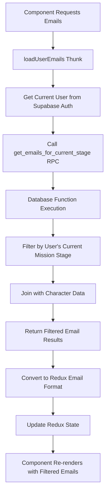

# System Tycoon - State Flow Documentation

## Overview
This document describes the state management flow in System Tycoon, focusing on how data flows through the application and how state changes are coordinated between different features.

## Core State Architecture

### 1. Redux State Management
- **Store Structure**: Centralized Redux store with feature-based slices
- **State Normalization**: Data is normalized to prevent duplication and maintain consistency
- **Immutable Updates**: All state changes use immutable update patterns

## Email State Management

### Current Mission Stage Filtering
The email system now implements **stage-based filtering** to ensure users only see emails relevant to their current mission stage:

#### Database Layer
- **Function**: `get_emails_for_current_stage(p_user_id UUID)`
- **Purpose**: Server-side filtering of emails based on user's current mission progress
- **Logic**: 
  - Queries user's current mission stage from `user_mission_progress`
  - Returns only emails associated with the current stage
  - Handles cases where user hasn't started missions (shows stage 1 emails)
  - Joins with character data for proper sender information

#### Service Layer (`src/services/emailService.ts`)
- **fetchEmails()**: Now calls the database function instead of fetching all emails
- **fetchEmailsByCategory()**: Filters by category after stage-based filtering
- **Authentication**: Uses Supabase auth to get current user ID
- **Error Handling**: Falls back to static emails if database query fails

#### Redux Layer (`src/store/slices/emailSlice.ts`)
- **loadUserEmails**: Async thunk that loads stage-filtered emails
- **loadEmailsByCategory**: Loads emails filtered by both stage and category
- **State Updates**: 
  - Clears existing emails on fresh load
  - Normalizes emails by ID and category
  - Automatically marks emails as "available" since they're pre-filtered
  - Updates unread count based on filtered results

### State Flow for Email Loading

### Benefits of Stage-Based Filtering

1. **Improved User Experience**: Users see only relevant emails for their current progress
2. **Performance**: Reduced data transfer and client-side processing
3. **Game Flow**: Maintains proper mission progression and story coherence
4. **Scalability**: Database-level filtering scales better than client-side filtering

## Mission Progress Integration

### User Mission Progress Tracking
- **Table**: `user_mission_progress`
- **Key Fields**: 
  - `user_id`: Links to authenticated user
  - `mission_id`: Current mission
  - `current_stage_id`: User's current stage
  - `status`: Mission status (in_progress, completed, etc.)

### Email Availability Logic
1. User starts a mission → Gets stage 1 emails
2. User completes stage 1 → Gets stage 2 emails  
3. Email system automatically adjusts based on `current_stage_id`
4. No manual email unlocking required

## Best Practices Implementation

### Redux Best Practices
- ✅ **Normalized State**: Emails stored by ID, referenced by category arrays
- ✅ **Immutable Updates**: Using Redux Toolkit's Immer integration
- ✅ **Single Source of Truth**: Database function ensures consistent filtering
- ✅ **Async Thunks**: Proper handling of async operations with loading states
- ✅ **Type Safety**: Full TypeScript integration with proper typing

### Error Handling
- Graceful fallback to static emails if database unavailable
- Authentication checks before making database calls
- Proper error messages propagated to UI layer

### Performance Optimizations
- Database-level filtering reduces payload size
- Normalized Redux state prevents unnecessary re-renders
- Efficient category-based email organization

## Integration Points

### Authentication Integration
- Uses Supabase auth to get current user ID
- Requires authenticated user for email filtering
- Demo mode support for non-authenticated users

### Mission System Integration
- Reads from mission progress tables
- Automatically updates email availability
- Maintains consistency with mission advancement

### UI Integration
- EmailClient component automatically gets filtered emails
- No changes required to display logic
- Maintains existing category-based organization

## Future Enhancements

1. **Real-time Updates**: Could add real-time subscriptions for new emails
2. **Email Triggers**: Automatic email delivery on stage completion
3. **Personalization**: User-specific email content based on progress
4. **Analytics**: Track email engagement and mission progression correlation 