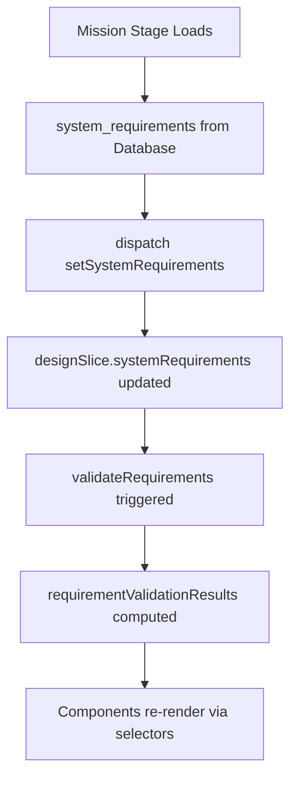
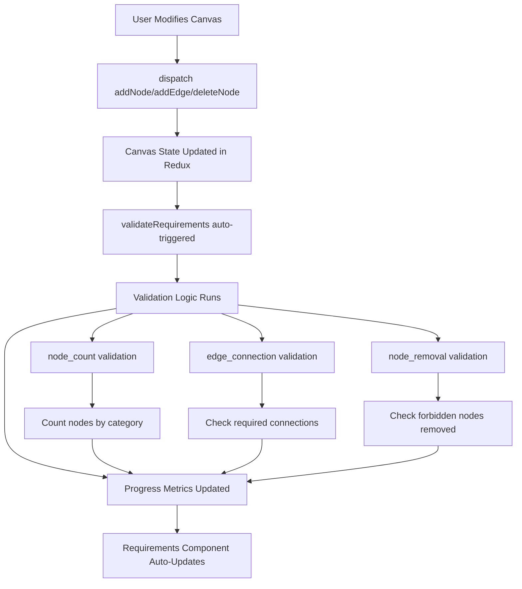
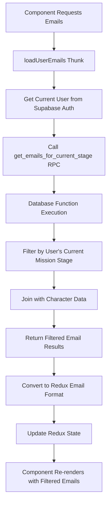

# ⚠️ **DEPRECATED - Content Consolidated**

**This document has been consolidated into [redux_implementation_summary.md](../redux_implementation_summary.md)**

All state flow documentation, validation patterns, and architecture information from this document have been merged into the comprehensive Redux implementation summary. Please refer to that document for the latest state management guidance.

---

# System Tycoon - State Flow Documentation

## Overview
This document describes the state management flow in System Tycoon, focusing on how data flows through the application and how state changes are coordinated between different features, with emphasis on the centralized Redux-based requirements validation system.

## Core State Architecture

### 1. Redux State Management
- **Store Structure**: Centralized Redux store with feature-based slices
- **State Normalization**: Data is normalized to prevent duplication and maintain consistency
- **Immutable Updates**: All state changes use immutable update patterns
- **Memoized Selectors**: Performance-optimized computed state via createSelector

## Requirements Validation State Flow (NEW)

### Centralized Requirements Management
The requirements validation system now follows Redux best practices with centralized state management in the `designSlice`:

#### 1. Mission Stage Requirements Loading


#### 2. Real-time Validation Flow


### Redux State Structure for Requirements

```typescript
// designSlice state includes requirements validation
interface DesignState {
  // Canvas State
  nodes: Node[];
  edges: Edge[];
  
  // Requirements Validation State
  systemRequirements: SystemRequirement[];           // From mission_stages
  requirementValidationResults: RequirementValidationResult[];  // Real-time validation
  allRequirementsMet: boolean;                       // Overall completion status
  requirementProgress: {
    completed: number;    // Number of completed requirements
    total: number;        // Total number of requirements
    percentage: number;   // Completion percentage
  };
}
```

### Component Connection Pattern

#### ✅ Redux-First Approach (NEW)
```typescript
// Requirements component connects directly to Redux
export const Requirements: React.FC<RequirementsProps> = ({ onTestSystem }) => {
  // Direct Redux connection via memoized selectors
  const requirementsStatus = useAppSelector(selectRequirementsStatus);
  const canvasValidation = useAppSelector(selectCanvasValidation);
  
  // No props needed - all data comes from Redux
  const { requirements, progress, allMet } = requirementsStatus;
  const { canProceed } = canvasValidation;
  
  return (
    <div>
      {/* UI renders from Redux state */}
      {requirements.map(req => (
        <RequirementItem key={req.id} requirement={req} />
      ))}
    </div>
  );
};
```

#### ❌ Old Prop Drilling Approach (DEPRECATED)
```typescript
// OLD: Props passed down from parent component
<Requirements
  requirements={requirements}
  systemRequirements={missionStageData.system_requirements}
  canvasNodes={nodes}
  canvasEdges={edges}
  onTestSystem={handleRunTest}
/>
```

### Validation Engine Implementation

#### Automatic Validation Triggers
```typescript
// All canvas-modifying actions automatically trigger validation
const designSlice = createSlice({
  name: 'design',
  reducers: {
    addNode: (state, action) => {
      // ... add node logic
      designSlice.caseReducers.validateRequirements(state);  // ← Automatic validation
      designSlice.caseReducers.validateDesign(state);
    },
    
    addEdge: (state, action) => {
      // ... add edge logic
      designSlice.caseReducers.validateRequirements(state);  // ← Automatic validation
      designSlice.caseReducers.validateDesign(state);
    },
    
    deleteNode: (state, action) => {
      // ... delete node logic
      designSlice.caseReducers.validateRequirements(state);  // ← Automatic validation
      designSlice.caseReducers.validateDesign(state);
    }
  }
});
```

#### Validation Logic by Requirement Type
```typescript
validateRequirements: (state) => {
  state.systemRequirements.forEach(requirement => {
    switch (requirement.validation_type) {
      case 'node_count':
        // Count nodes by category and compare to minimum required
        const results = Object.entries(requirement.min_nodes_of_type).map(([category, minCount]) => {
          const nodeCount = state.nodes.filter(node => 
            matchesComponentCategory(node, category)
          ).length;
          return { category, required: minCount, actual: nodeCount, met: nodeCount >= minCount };
        });
        completed = results.every(r => r.met);
        break;
        
      case 'edge_connection':
        // Check for required connections between component types
        const { from, to } = requirement.required_connection;
        completed = state.edges.some(edge => {
          const sourceNode = state.nodes.find(n => n.id === edge.source);
          const targetNode = state.nodes.find(n => n.id === edge.target);
          return matchesComponentType(sourceNode, from) && matchesComponentType(targetNode, to);
        });
        break;
        
      case 'node_removal':
        // Verify forbidden nodes are removed from canvas
        const forbiddenNodesPresent = requirement.required_nodes.filter(forbiddenId => 
          state.nodes.some(node => node.id === forbiddenId)
        );
        completed = forbiddenNodesPresent.length === 0;
        break;
    }
  });
}
```

## Email State Management

### Current Mission Stage Filtering
The email system implements **stage-based filtering** to ensure users only see emails relevant to their current mission stage:

#### Database Layer
- **Function**: `get_emails_for_current_stage(p_user_id UUID)`
- **Purpose**: Server-side filtering of emails based on user's current mission progress
- **Logic**: 
  - Queries user's current mission stage from `user_mission_progress`
  - Returns only emails associated with the current stage
  - Handles cases where user hasn't started missions (shows stage 1 emails)
  - Joins with character data for proper sender information

#### Service Layer (`src/services/emailService.ts`)
- **fetchEmails()**: Now calls the database function instead of fetching all emails
- **fetchEmailsByCategory()**: Filters by category after stage-based filtering
- **Authentication**: Uses Supabase auth to get current user ID
- **Error Handling**: Falls back to static emails if database query fails

#### Redux Layer (`src/store/slices/emailSlice.ts`)
- **loadUserEmails**: Async thunk that loads stage-filtered emails
- **loadEmailsByCategory**: Loads emails filtered by both stage and category
- **State Updates**: 
  - Clears existing emails on fresh load
  - Normalizes emails by ID and category
  - Automatically marks emails as "available" since they're pre-filtered
  - Updates unread count based on filtered results

### State Flow for Email Loading



## Benefits of Redux-First Architecture

### 1. **Single Source of Truth**
- All requirements validation logic centralized in `designSlice`
- No prop drilling or state duplication across components
- Consistent validation state across the entire application

### 2. **Automatic State Synchronization**
- Canvas changes automatically trigger requirement validation
- Real-time feedback without manual validation calls
- Components automatically re-render when validation state changes

### 3. **Performance Optimization**
- Memoized selectors prevent unnecessary re-renders
- Efficient validation only when canvas actually changes
- Redux DevTools provide complete state visibility

### 4. **Developer Experience**
- Clear separation between UI logic and business logic
- Easy to test pure validation functions in Redux slices
- Type-safe selectors with TypeScript integration

### 5. **Scalability**
- Easy to add new requirement types and validation rules
- Extensible validation engine architecture
- Maintainable codebase with clear data flow

## Mission Progress Integration

### User Mission Progress Tracking
- **Table**: `user_mission_progress`
- **Key Fields**: 
  - `user_id`: Links to authenticated user
  - `mission_id`: Current mission
  - `current_stage_id`: User's current stage
  - `status`: Mission status (in_progress, completed, etc.)

### Email Availability Logic
1. User starts a mission → Gets stage 1 emails
2. User completes stage 1 → Gets stage 2 emails  
3. Email system automatically adjusts based on `current_stage_id`
4. No manual email unlocking required

## Best Practices Implementation

### Redux Best Practices
- ✅ **Centralized State**: All related state in Redux slices
- ✅ **Memoized Selectors**: Performance-optimized computed state
- ✅ **Direct Component Connection**: No prop drilling for Redux state
- ✅ **Immutable Updates**: Using Redux Toolkit's Immer integration
- ✅ **Single Source of Truth**: Database-driven state management
- ✅ **Async Thunks**: Proper handling of async operations with loading states
- ✅ **Type Safety**: Full TypeScript integration with proper typing

### Component Architecture
- ✅ **Presentation Components**: Focus on UI rendering from Redux state
- ✅ **Container Logic**: Minimal - mostly just selector connections
- ✅ **Business Logic**: Centralized in Redux slices and middleware
- ✅ **Side Effects**: Handled via Redux actions and thunks

### Error Handling
- Graceful fallback to static data if validation fails
- Authentication checks before making database calls
- Proper error messages propagated to UI layer
- State consistency maintained during error scenarios

### Performance Optimizations
- Database-level filtering reduces payload size
- Normalized Redux state prevents unnecessary re-renders
- Memoized selectors for expensive computations
- Automatic validation only when canvas state actually changes

## Integration Points

### Authentication Integration
- Uses Supabase auth to get current user ID
- Requires authenticated user for personalized state
- Demo mode support for non-authenticated users

### Mission System Integration
- Reads from mission progress tables for stage-based filtering
- Requirements loaded from `mission_stages.system_requirements`
- Automatically updates state based on mission advancement
- Maintains consistency with mission progression

### UI Integration
- Components automatically get state updates via Redux selectors
- No manual state management in component layer
- Maintains existing UI patterns while improving data flow

## Future Enhancements

1. **Advanced Validation Rules**: Support for performance metrics, security requirements
2. **Real-time Updates**: WebSocket integration for collaborative validation
3. **Validation Hints**: Contextual guidance when requirements aren't met
4. **Requirement Dependencies**: Complex validation chains between requirements
5. **Custom Validators**: Plugin system for game-specific validation logic
6. **Analytics Integration**: Track requirement completion patterns 